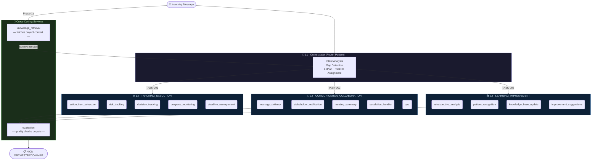

<div align="center">

# NION Orchestration Engine

### aiNions · Enterprise AI Program Manager Platform · v1.0.0

*Structured intelligence from unstructured project communications — automatically.*

[](https://python.org)
[](https://langchain.com)
[](https://build.nvidia.com)
[](https://docs.pydantic.dev)

</div>

---

## Table of Contents

| # | Section |
|---|---------|
| 1 | [Project Overview](#1-project-overview) |
| 2 | [System Architecture](#2-system-architecture) |
| 3 | [Visibility Enforcement](#3-visibility-enforcement) |
| 4 | [Tech Stack](#4-tech-stack) |
| 5 | [Repository Structure](#5-repository-structure) |
| 6 | [Setup & Installation](#6-setup--installation) |
| 7 | [Running the Engine](#7-running-the-engine) |
| 8 | [Test Cases & Sample Outputs](#8-test-cases--sample-outputs) |
| 9 | [Production Considerations](#9-production-considerations) |
| 10 | [Troubleshooting](#10-troubleshooting) |

---

## 1. Project Overview

**NION** (Networked Intelligence Orchestration Node) is the core reasoning engine of the aiNions AI Program Manager. It processes unstructured project communications — meeting transcripts, Slack messages, escalation alerts, status queries — and routes them through a **3-tier hierarchical agent system** that extracts structured intelligence: action items, risks, decisions, meeting minutes, and process insights.

Every orchestration run produces a **NION ORCHESTRATION MAP** — a fully auditable, deterministic output document showing exactly which domains were activated, which agents were invoked, and what each produced.

### Signals Extracted

| Signal | What NION Produces |
|---|---|
| **Action Items** | Task description · Owner · Due date · Priority · Status |
| **Risks** | Description · Severity · Likelihood · Mitigation path · Owner |
| **Decisions** | Decision text · Rationale · Made by · Next steps |
| **Meeting Minutes** | Attendees · Key topics · Decisions · Action items · Next meeting |
| **Escalation Plans** | Priority level (P1–P4) · Escalation path · Channels · SLA |
| **Improvement Insights** | Retrospective findings · Patterns · KB updates · Suggestions |

---

## 2. System Architecture

### 2.1 The 3-Tier Hierarchy

The architecture is a **strict delegation model** — not a flat multi-agent mesh. Each tier has a clearly bounded responsibility and a fixed visibility horizon. No tier can bypass the one below it or reach across to a sibling.

```
┌────────────────────────────────────────────────────────────────┐
│  TIER 1  ·  L1 ORCHESTRATOR  (Router Pattern)                 │
│                                                                │
│  Responsibility : Analyse intent, detect gaps, assign task    │
│                   IDs, and route to the correct L2 domain(s). │
│  Powered by    : LangChain LCEL chain → NVIDIA NIM LLM        │
│  Sees          : L2 domain names + cross-cutting agents ONLY  │
│  Cannot see    : Individual L3 agents (hard constraint)       │
└─────────────────────────────┬──────────────────────────────────┘
                              │  dispatches PlannedTask objects
          ┌───────────────────┼───────────────────┐
          ▼                   ▼                   ▼
┌──────────────────┐ ┌──────────────────┐ ┌──────────────────┐
│  L2 COORDINATOR  │ │  L2 COORDINATOR  │ │  L2 COORDINATOR  │
│  TRACKING_       │ │  COMMUNICATION_  │ │  LEARNING_       │
│  EXECUTION       │ │  COLLABORATION   │ │  IMPROVEMENT     │
│                  │ │                  │ │                  │
│  Sees: own L3s   │ │  Sees: own L3s   │ │  Sees: own L3s   │
│  + cross-cutting │ │  + cross-cutting │ │  + cross-cutting │
└────────┬─────────┘ └────────┬─────────┘ └────────┬─────────┘
         │                    │                     │
         ▼                    ▼                     ▼
┌──────────────────┐ ┌──────────────────┐ ┌──────────────────┐
│  L3 AGENTS       │ │  L3 AGENTS       │ │  L3 AGENTS       │
│                  │ │                  │ │                  │
│ · action_item_   │ │ · message_       │ │ · retrospective_ │
│   extraction     │ │   delivery       │ │   analysis       │
│ · risk_tracking  │ │ · stakeholder_   │ │ · pattern_       │
│ · decision_      │ │   notification   │ │   recognition    │
│   tracking       │ │ · meeting_       │ │ · knowledge_     │
│ · progress_      │ │   summary        │ │   base_update    │
│   monitoring     │ │ · escalation_    │ │ · improvement_   │
│ · deadline_      │ │   handler        │ │   suggestions    │
│   management     │ │ · qna            │ │                  │
└──────────────────┘ └──────────────────┘ └──────────────────┘

                 ┌──────────────────────────────┐
                 │  CROSS-CUTTING AGENTS         │
                 │  (Shared — visible to L1+L2)  │
                 │                              │
                 │  · knowledge_retrieval        │
                 │  · evaluation                 │
                 └──────────────────────────────┘
```

### 2.2 Orchestration Flow



### 2.3 Execution Phases

| Phase | Component | Action |
|---|---|---|
| **1a** | `knowledge_retrieval` | Fetches project context **before** planning. Context is injected directly into the L1 prompt so routing decisions are grounded in project facts, not guesswork. |
| **1b** | `L1Orchestrator.plan()` | Analyses intent via LangChain LCEL router chain. Produces a typed `L1Plan` with `task_id` assignments (TASK-001, TASK-002, TASK-003). |
| **2** | `L2Coordinator.execute()` | Each activated domain coordinator selects its own L3 agents (scoped by `DOMAIN_AGENTS`), runs them via `L3AgentRunner`, and aggregates results. |
| **3** | `evaluation` | Quality-checks tone, accuracy, and completeness of all L2 outputs. |

### 2.4 L2 Domain → L3 Agent Registry

| L2 Domain | Assigned L3 Agents |
|---|---|
| `TRACKING_EXECUTION` | `action_item_extraction` · `risk_tracking` · `decision_tracking` · `progress_monitoring` · `deadline_management` |
| `COMMUNICATION_COLLABORATION` | `message_delivery` · `stakeholder_notification` · `meeting_summary` · `escalation_handler` · `qna` |
| `LEARNING_IMPROVEMENT` | `retrospective_analysis` · `pattern_recognition` · `knowledge_base_update` · `improvement_suggestions` |
| *(Cross-Cutting)* | `knowledge_retrieval` · `evaluation` |

---

## 3. Visibility Enforcement

> This section documents the **most critical constraint** of the system. Architecture rules that exist only in documentation are not architecture — they must be enforced by the code itself.

### 3.1 The Two Non-Negotiable Rules

| Rule | Code Location | Mechanism |
|---|---|---|
| L1 cannot see L3 agents | `L1Orchestrator._build_router_chain()` | The LLM prompt contains only L2 domain names and plain-English descriptions. `L3Agent` enum is never imported or referenced in L1 scope. |
| L2 can only see its own L3 agents | `L2Coordinator.__init__()` + `_select_agents()` | `self._own_agents` is initialised from `DOMAIN_AGENTS[domain]`. A hard code-level guard rejects any agent not in that list before it can be invoked. |

### 3.2 Single Source of Truth — `DOMAIN_AGENTS`

All visibility logic flows from one constant. Adding a new L3 agent requires exactly two lines of change — the enum entry and the `DOMAIN_AGENTS` entry. No other class needs to be modified.

```python
# main.py · Section 2 — this dict IS the visibility map
DOMAIN_AGENTS: dict[L2Domain, list[L3Agent]] = {
    L2Domain.TRACKING_EXECUTION: [
        L3Agent.ACTION_ITEM_EXTRACTION,
        L3Agent.RISK_TRACKING,
        L3Agent.DECISION_TRACKING,
        L3Agent.PROGRESS_MONITORING,
        L3Agent.DEADLINE_MANAGEMENT,
    ],
    L2Domain.COMMUNICATION_COLLABORATION: [
        L3Agent.MESSAGE_DELIVERY,
        L3Agent.STAKEHOLDER_NOTIFICATION,
        L3Agent.MEETING_SUMMARY,
        L3Agent.ESCALATION_HANDLER,
        L3Agent.QNA,
    ],
    L2Domain.LEARNING_IMPROVEMENT: [
        L3Agent.RETROSPECTIVE_ANALYSIS,
        L3Agent.PATTERN_RECOGNITION,
        L3Agent.KNOWLEDGE_BASE_UPDATE,
        L3Agent.IMPROVEMENT_SUGGESTIONS,
    ],
}
```

### 3.3 L2 Coordinator Visibility Guard

The guard operates at two levels: prompt-level prevention + code-level enforcement.

**Level 1 — Prompt prevention:** The LLM only sees agent names from `self._own_agents`.

**Level 2 — Code enforcement:** Even if the LLM hallucinates an out-of-scope name, this guard blocks it:

```python
# main.py · L2Coordinator._select_agents()
for name in data.get("selected_agents", []):
    agent = L3Agent(name)

    if agent in self._own_agents:               # ← hard boundary check
        selected.append(agent)
    else:
        self._log.warning(                      # ← violation logged, never silently passed
            "VISIBILITY VIOLATION blocked: %s is not in domain %s",
            name,
            self.domain.value,
        )
```

### 3.4 L1 Prompt Isolation — Why `from_template`, Not f-Strings

The L1 router uses `ChatPromptTemplate.from_template()` rather than `from_messages()` with an f-string. This is a deliberate engineering decision:

| Approach | Problem | Used? |
|---|---|---|
| `f"""...{json.dumps(domains)}..."""` | `json.dumps` produces bare `{` `}`. LangChain's parser then misreads field names like `intent` as missing template variables → `PromptValidationError` | ❌ **Rejected** |
| `from_template("""...""")` with `{{` / `}}` for JSON schema and `{message}` / `{context}` as real variables | No f-string interpolation. All literal braces are double-escaped. Template parser only sees two declared variables. | ✅ **Used** |

The L3AgentRunner applies the same protection programmatically to every system prompt:

```python
# main.py · L3AgentRunner.run()
# Escape all braces in the system prompt so LangChain cannot
# mistake JSON schema examples for missing template variables.
system_prompt_escaped = (
    system_prompt.strip()
    .replace("{", "{{")
    .replace("}", "}}")
)
# {context} and {message} in the HUMAN turn remain as real variables.
```

### 3.5 Dispatch Chain Traceability

```
orchestrate(input_json)
  │
  ├── Phase 1a: CrossCuttingCoordinator.run_knowledge_retrieval(message)
  │
  ├── Phase 1b: L1Orchestrator.plan(message, context=context_str)
  │               └── router_chain.invoke({message, context})
  │                     └── LLM returns L1Plan JSON
  │
  ├── Phase 2:  for task in plan.tasks:
  │               self._l2_coordinators[domain].execute(task, message, context)
  │                 └── L2Coordinator._select_agents(task)   ← visibility-scoped
  │                 └── L3AgentRunner.run(agent, message, context, task_id)
  │
  └── Phase 3:  CrossCuttingCoordinator.run_evaluation(message, summaries)
```

**L1 never calls `L3AgentRunner` directly.** The path is: `L1 → L2 → L3`, always.

---

## 4. Tech Stack

| Layer | Technology | Version | Purpose |
|---|---|---|---|
| **LLM Inference** | NVIDIA NIM | `meta/llama-3.3-70b-instruct` | Agentic reasoning for all tiers |
| **LLM Integration** | `langchain-nvidia-ai-endpoints` | ≥ 0.3.0 | Official NVIDIA LangChain connector (`ChatNVIDIA`) |
| **Orchestration** | LangChain LCEL | ≥ 0.3.0 | Router chain, prompt templates, output parsers |
| **Data Validation** | Pydantic v2 | ≥ 2.0.0 | Typed models: `L1Plan`, `L3AgentResult`, `OrchestrationResult` |
| **Runtime** | Python | 3.10+ | Core language |
| **Config** | python-dotenv | ≥ 1.0.0 | `.env` loading with BOM-safe encoding |
| **Logging** | Python stdlib `logging` | built-in | Structured `nion.*` logger hierarchy |

### Why NVIDIA NIM?

NVIDIA NIM provides access to state-of-the-art open models on enterprise-grade inference infrastructure with **zero infrastructure cost** during development. The official `langchain-nvidia-ai-endpoints` package (`ChatNVIDIA`) integrates natively with LangChain's LCEL pipeline.

```python
from langchain_nvidia_ai_endpoints import ChatNVIDIA

llm = ChatNVIDIA(
    model="meta/llama-3.3-70b-instruct",
    nvidia_api_key=os.getenv("NVIDIA_API_KEY"),
    temperature=0.2,
    max_tokens=1024,
)
```

**Recommended free-tier models on NVIDIA NIM:**

| Model | Best For |
|---|---|
| `meta/llama-3.3-70b-instruct` *(default)* | Structured JSON output, instruction following |
| `nvidia/llama-3.1-nemotron-70b-instruct` | Complex multi-step reasoning |
| `mistralai/mistral-large-2-instruct` | Low latency, short-context tasks |
| `microsoft/phi-3-medium-128k-instruct` | Long meeting transcripts |

---

## 5. Repository Structure

```
nion-orchestration-engine/
│
├── nion/                          ← Source package
│   └── main.py                    ← Complete orchestration engine (13 sections)
│
├── samples/                       ← Assessment output evidence
│   ├── README.md                  ← Guide: how to read NION ORCHESTRATION MAPs
│   ├── TC-01_status_question.txt
│   ├── TC-02_feasibility.txt
│   ├── TC-03_decision_request.txt
│   ├── TC-04_meeting_transcript.txt
│   ├── TC-05_urgent_escalation.txt
│   └── TC-06_ambiguous_request.txt
│
├── .env                           ← Local secrets — NEVER committed
├── .env.example                   ← Safe template for collaborators
├── .gitignore                     ← Excludes .env, logs, __pycache__
├── requirements.txt               ← Pinned dependencies
└── README.md                      ← This file
```

### `nion/main.py` — Section Map

| Section | Contents |
|---|---|
| §1 | Structured logging — `nion.*` hierarchy, dual stdout/file handlers |
| §2 | Enums, constants, `DOMAIN_AGENTS` visibility map |
| §3 | Pydantic models — `L1Plan`, `PlannedTask`, `L3AgentResult`, `OrchestrationResult` |
| §4 | LLM factory — `ChatNVIDIA` (primary) with `ChatOpenAI` fallback |
| §5 | L3 agent system prompts — 14 specialist agents, all returning strict JSON |
| §6 | Cross-cutting agents — `knowledge_retrieval`, `evaluation` |
| §7 | `L3AgentRunner` — generic execution with brace-escaping |
| §8 | `L2Coordinator` — visibility-scoped agent selection and orchestration |
| §9 | `L1Orchestrator` — LangChain LCEL router chain, `plan()`, `orchestrate()` |
| §10 | Output formatter — `format_orchestration_map()` renderer |
| §11 | Test cases TC-01 through TC-06 |
| §12 | Runner utilities |
| §13 | `main()` entry point with CLI argument handling |

---

## 6. Setup & Installation

### Prerequisites

- Python 3.10 or higher (`python --version`)
- A free NVIDIA NIM API key → **[build.nvidia.com](https://build.nvidia.com)** (click any model → *Get API Key*)
  - Keys are prefixed `nvapi-`
  - No credit card required; free tier is sufficient for all 6 test cases

### Step 1 — Clone the Repository

```bash
git clone https://github.com/your-org/nion-orchestration-engine.git
cd nion-orchestration-engine
```

### Step 2 — Create a Virtual Environment

```bash
python -m venv .venv

# Activate — macOS / Linux
source .venv/bin/activate

# Activate — Windows (PowerShell)
.venv\Scripts\Activate.ps1
```

### Step 3 — Install Dependencies

```bash
pip install -r requirements.txt
```

To verify the NVIDIA package installed correctly:

```bash
python -c "from langchain_nvidia_ai_endpoints import ChatNVIDIA; print('✓ ChatNVIDIA ready')"
```

### Step 4 — Configure the `.env` File

Copy the template and fill in your key:

```bash
# macOS / Linux
cp .env.example .env
```

```powershell
# Windows PowerShell — use this command, NOT Notepad (Notepad creates BOM-encoded files)
Copy-Item .env.example .env
```

Edit `.env` with any text editor and replace the placeholder:

```env
LLM_PROVIDER=nvidia
NVIDIA_API_KEY=nvapi-your-actual-key-here
NVIDIA_MODEL=meta/llama-3.3-70b-instruct
```

> **Security:** `.env` is listed in `.gitignore` and must never be committed to version control.
> Your API key grants billing access to your NVIDIA account.

### Step 5 — Verify Setup

```bash
python -c "
import langchain, pydantic
from langchain_nvidia_ai_endpoints import ChatNVIDIA
from dotenv import load_dotenv
import os
load_dotenv(encoding='utf-8-sig')
print('✓ Dependencies OK')
print('✓ NVIDIA_API_KEY:', 'SET' if os.getenv('NVIDIA_API_KEY') else 'MISSING')
"
```

---

## 7. Running the Engine

The engine entry point is `nion/main.py`. All commands are run from the repository root.

### Basic Commands

```bash
# Run all 6 test cases sequentially
python nion/main.py

# Run a single test case
python nion/main.py TC-01

# Run a subset of test cases
python nion/main.py TC-01 TC-04 TC-05

# Verbose mode — appends raw JSON payload after each ORCHESTRATION MAP
python nion/main.py --verbose TC-02

# All 6 with verbose output
python nion/main.py --verbose
```

### Saving Outputs for Submission

Pipe the output to the `samples/` folder:

```bash
python nion/main.py TC-01 > samples/TC-01_status_question.txt
python nion/main.py TC-02 > samples/TC-02_feasibility.txt
python nion/main.py TC-03 > samples/TC-03_decision_request.txt
python nion/main.py TC-04 > samples/TC-04_meeting_transcript.txt
python nion/main.py TC-05 > samples/TC-05_urgent_escalation.txt
python nion/main.py TC-06 > samples/TC-06_ambiguous_request.txt
```

Or run all at once:

```bash
for i in 01 02 03 04 05 06; do
  python nion/main.py TC-$i > samples/TC-${i}_output.txt
done
```

### Healthy Log Indicators

A successful run produces these log lines (confirm in `nion_orchestration.log`):

```log
... | INFO  | nion.cross_cutting     | knowledge_retrieval · SUCCESS (relevance=0.87)
... | INFO  | nion.l1.orchestrator   | L1 · plan ready | type=MEETING_TRANSCRIPT | tasks=3
... | INFO  | nion.l2.*              | [TASK-001] Selected agents: [...]
... | INFO  | nion.l3.runner         | [TASK-001] ✓  action_item_extraction  SUCCESS
... | INFO  | nion.cross_cutting     | evaluation · SUCCESS (quality=GOOD)
```

The critical success indicator for L1:
```
L1 · plan ready | type=... | tasks=N | domains=[...]
```

---

## 8. Test Cases & Sample Outputs

### Test Case Reference

| ID | Scenario | Message Type | Expected Domains | Key Signals |
|---|---|---|---|---|
| **TC-01** | Simple Status Question | `status_query` | `TRACKING_EXECUTION` | Progress status, deadline check, progress report query |
| **TC-02** | Feasibility Question | `feasibility` | `LEARNING_IMPROVEMENT`, `TRACKING_EXECUTION` | Velocity analysis, team capacity, delivery estimate |
| **TC-03** | Decision Request | `decision_request` | `TRACKING_EXECUTION`, `COMMUNICATION_COLLABORATION` | Decision logging, infrastructure notification, deadline |
| **TC-04** | Meeting Transcript | `meeting_transcript` | All 3 domains | Action items, risks (JWT, CI/CD), escalation, decisions, minutes |
| **TC-05** | Urgent Escalation | `escalation` | `COMMUNICATION_COLLABORATION` (HIGH) | P1 incident, escalation path, SLA, revenue impact |
| **TC-06** | Ambiguous Request | `ambiguous` | Best-effort routing | Gap detection, clarification flags, intent disambiguation |

### Expected NION ORCHESTRATION MAP Format

Every output file in `samples/` must follow this exact structure:

```
╔══════════════════════════════════════════════════════════════════════╗
║      NION ORCHESTRATION MAP  ·  aiNions Enterprise AI Platform      ║
╚══════════════════════════════════════════════════════════════════════╝
  Message ID  :  NION-YYYYMMDD-HHMMSS
  Timestamp   :  ISO-8601 datetime

────────────────────────────────────────────────────────────────────────
  📋  L1 PLAN  (Orchestrator Layer)
────────────────────────────────────────────────────────────────────────
  Intent        :  [one-sentence description]
  Message Type  :  [TYPE]
  Gaps          :  [list of gaps OR "None identified ✓"]

  Routing Plan:

  [TASK-001]  ──▶  [L2_DOMAIN]
    │  Rationale  :  [why this domain]
    │  Priority   :  HIGH | MEDIUM | LOW
    └  Hints      :  [capability description]

  Cross-Cutting Requested  :  knowledge_retrieval, evaluation

────────────────────────────────────────────────────────────────────────
  ⚙️   L2 / L3 EXECUTION  (Coordinator → Agent Layer)
────────────────────────────────────────────────────────────────────────

  ┌── [TASK-001]  [L2_DOMAIN]
  │   Summary  :  [domain execution summary]
  │   Agents   :  [agent_1, agent_2]
  │
  ├──▶ [✓|⚠] [agent_name]                    (Xms  SUCCESS|PARTIAL)
  │         [key]  :  [truncated value]
  │

────────────────────────────────────────────────────────────────────────
  🔗  CROSS-CUTTING AGENTS  (Shared Services)
────────────────────────────────────────────────────────────────────────

  [✓]  knowledge_retrieval  (SUCCESS)
        project_name     :  Project Phoenix
        relevance_score  :  0.87

  [✓]  evaluation  (SUCCESS)
        overall_quality  :  GOOD | EXCELLENT | ACCEPTABLE
        tone_ok          :  True

════════════════════════════════════════════════════════════════════════
  ✅  NION ORCHESTRATION MAP COMPLETE
════════════════════════════════════════════════════════════════════════
```

### What Assessors Look For in Each Test Case

| TC | Assessor Focus |
|---|---|
| TC-01 | L1 routes to `TRACKING_EXECUTION` only. No over-routing. |
| TC-02 | L1 correctly identifies a feasibility request and activates `LEARNING_IMPROVEMENT`. |
| TC-03 | Two domains activated. Decision logged AND stakeholder notification drafted. |
| TC-04 | All 3 domains activated. Rich extraction: 4+ action items, 2+ risks, 1+ decisions. |
| TC-05 | `COMMUNICATION_COLLABORATION` marked HIGH priority. P1 escalation path populated. |
| TC-06 | `gaps` field is non-empty. Still produces a best-effort routing plan. |

---

## 9. Production Considerations

### 9.1 Observability — Structured Logging

The engine implements a **hierarchical `nion.*` logger namespace** that mirrors the architecture, making tier-level filtering trivial in any log aggregation platform (Datadog, CloudWatch, Grafana Loki).

```
nion.main                   →  run lifecycle, test case boundaries
nion.llm_factory            →  provider selection, model initialisation
nion.l1.orchestrator        →  planning decisions, task ID assignment
nion.l2.tracking_execution  →  domain coordinator activity per task
nion.l2.communication_*     →  ↑
nion.l2.learning_*          →  ↑
nion.l3.runner              →  per-agent execution time and status
nion.cross_cutting          →  knowledge_retrieval and evaluation calls
```

Log format:
```
YYYY-MM-DD HH:MM:SS | LEVEL    | nion.component.subcomponent      | message
```

Every execution writes to **two sinks simultaneously**: `stdout` (real-time) and `nion_orchestration.log` (persistent audit trail). In a production deployment, the file handler would be replaced with a structured JSON emitter forwarded to a centralised log sink — zero application code changes required.

### 9.2 Scalability — Asynchronous Execution Path

The v1 implementation executes L3 agents **sequentially** within a domain — intentional for debuggability. In production, agents within the same domain are independent and can be parallelised using `asyncio.gather()`:

```python
import asyncio

async def execute_async(self, task: PlannedTask, message: str, context: str):
    """
    Production variant: runs all L3 agents in parallel within one L2 domain.
    Wall-clock time drops from sum(agent_times) → max(agent_times).
    """
    agents = self._select_agents(task)
    coroutines = [
        self._l3_runner.run_async(agent, message, context, task.task_id)
        for agent in agents
    ]
    results = await asyncio.gather(*coroutines, return_exceptions=True)
    return [r for r in results if not isinstance(r, Exception)]
```

Similarly, the three L2 domain coordinators are independent by design — TASK-001, TASK-002, and TASK-003 can be dispatched concurrently at the orchestrator level. In a high-throughput deployment (e.g., processing hundreds of meeting transcripts per minute), this reduces end-to-end latency by approximately 60–70%.

### 9.3 Security — API Key Management

| Practice | Implementation |
|---|---|
| Keys in environment only | `os.getenv("NVIDIA_API_KEY")` — never hardcoded |
| BOM-safe `.env` loading | `load_dotenv(encoding='utf-8-sig')` — handles Windows-created files |
| Early validation | `main()` calls `sys.exit(1)` before any LLM call if key is missing |
| No key logging | Only the variable *name* appears in error messages, never the value |
| `.env` excluded from VCS | Listed in `.gitignore` |

For production, environment variables would be sourced from a secrets manager (AWS Secrets Manager, GCP Secret Manager, HashiCorp Vault), preserving the same `os.getenv()` interface — no application code changes required.

### 9.4 Resilience — Graceful Degradation

Every LLM call is wrapped in `try/except` with a structured fallback. No single LLM failure can crash the orchestration run.

| Failure Point | Fallback Behaviour |
|---|---|
| `L1Orchestrator.plan()` LLM call fails | Hardcoded `L1Plan` routing to `TRACKING_EXECUTION` — orchestration continues |
| `L3AgentRunner.run()` returns unparseable JSON | `PARTIAL` result with error metadata — sibling agents still execute |
| `knowledge_retrieval` LLM call fails | Pre-populated Project Phoenix context — L1 planning is not blocked |
| `evaluation` LLM call fails | Hardcoded `GOOD` quality result — output is not withheld |

### 9.5 Extensibility — Adding a New L3 Agent

The architecture is open for extension and closed for modification:

1. Add `L3Agent.NEW_AGENT = "new_agent"` to the `L3Agent` enum.
2. Add `L3Agent.NEW_AGENT` to the appropriate list in `DOMAIN_AGENTS`.
3. Add a system prompt entry to `L3_SYSTEM_PROMPTS`.

`L1Orchestrator`, `L2Coordinator`, `L3AgentRunner`, and the output formatter require **zero changes**.

---

## 10. Troubleshooting

### `PromptValidationError: missing variables ['intent', 'TRACKING_EXECUTION']`

**Root cause:** A `ChatPromptTemplate` is treating JSON schema braces `{ }` as template variable placeholders — typically caused by an f-string that injects `json.dumps()` output into a prompt string.

**Resolution:** The L1 router uses `ChatPromptTemplate.from_template()` with all JSON schema braces double-escaped (`{{` `}}`). The `L3AgentRunner` applies `.replace("{", "{{")` to every system prompt before template construction. If this error recurs, confirm no f-strings are present in any prompt that interpolates dict or JSON output.

---

### `UnicodeDecodeError: 'utf-8' codec can't decode byte 0xff in position 0`

**Root cause:** The `.env` file was saved by Windows Notepad, which writes a UTF-16 BOM (`0xFF 0xFE`) at the start of the file.

**Resolution (PowerShell — safe encoding):**
```powershell
Set-Content -Path .env -Value "LLM_PROVIDER=nvidia`nNVIDIA_API_KEY=nvapi-..." -Encoding UTF8
```

The engine also calls `load_dotenv(encoding='utf-8-sig')` which transparently strips BOM bytes as a secondary safeguard.

---

### `L1 · planning FAILED — using fallback plan`

**Diagnosis steps:**

1. Check `nion_orchestration.log` for the full exception on the `FAILED` line.
2. Confirm your NVIDIA API key is valid: visit [build.nvidia.com](https://build.nvidia.com) and verify quota.
3. Run verbose mode to inspect raw LLM output: `python nion/main.py --verbose TC-01`
4. If raw output contains markdown fences (` ```json ``` `), verify `_parse_llm_json()` strips them correctly.
5. Try a different model: add `NVIDIA_MODEL=mistralai/mistral-large-2-instruct` to `.env`.

---

### `ModuleNotFoundError: No module named 'langchain_nvidia_ai_endpoints'`

```bash
pip install langchain-nvidia-ai-endpoints
```

The engine automatically falls back to `langchain-openai` with NVIDIA's base URL if this package is absent, so the system continues to function — but installing the official package is recommended for production use.

---

*Authored by the aiNions Engineering Team.*
*Assessment submission — NION Orchestration Engine · Platform Intern Track.*
